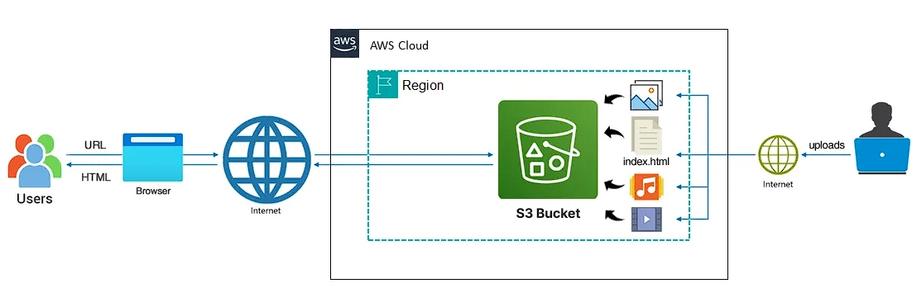

# Project 1: Host a Simple Website on Amazon S3 🚀

If you are new to cloud computing, managing servers can feel very hard. But did you know you can put a website on the internet without managing a single server? 

Welcome to Project 1! Today, we will learn the easiest and cheapest way to host a website using **Amazon S3 (Simple Storage Service)**. 

Instead of using servers, we will use S3 to save your static files (like HTML) and turn them into a real website that anyone in the world can visit.



### 🎯 What You Will Learn
* **AWS S3 Basics:** How to make a "Bucket" and upload files (called "Objects").
* **Static Website Hosting:** How to set up your S3 bucket to act like a web server.
* **Permissions & Security:** How to use Bucket Policies. By default, S3 buckets are private. You will learn how to safely open your bucket so people can see your website.

---

### 🛠️ What You Need First: Create Your Website File

Before we go to AWS, let's make a simple HTML file. We will save this as `index.html` inside the project folder.

```html
<html>
	<head>
		<title>Static Website Project</title>
	</head>
	<body>
		<h1>Congratulations!!! 🎉</h1>
		<h2>Welcome to my AWS S3 Static Website</h2>
	</body>
</html>
```

---

### 🚀 Step-by-Step Guide

#### Step 1: Create an S3 Bucket
A bucket is like a big folder that holds all your website files.
1. Log in to your **AWS Console**.
2. Search for the **S3** service and click on it.
3. Click the **Create bucket** button.
4. Type a name in the **Bucket name** box. *(Note: This name must be very unique. No one else in the world can have the same bucket name. Example: `my-first-website-project-12345`)*.
5. Leave all the other settings exactly as they are.
6. Go to the bottom and click **Create bucket**.

#### Step 2: Turn on Static Website Hosting
Now, we must tell AWS to use this bucket as a website.
1. Click on the name of the bucket you just made.
2. Click on the **Properties** tab at the top.
3. Scroll down until you see the **Static website hosting** section.
4. Click **Edit**.
5. Choose **Enable**.
6. In the **Index document** box, type: `index.html`.
7. Click **Save changes**.

#### Step 3: Allow Public Access
Usually, AWS locks S3 buckets so no one can see them. Because we want people to see our website, we need to unlock it.
1. Click on the **Permissions** tab at the top.
2. Look for **Block public access (bucket settings)** and click **Edit**.
3. **Uncheck** the box that says **Block all public access**.
4. Click **Save changes**. (AWS will ask you to type "confirm" in a box to make sure you want to do this).

#### Step 4: Add a Bucket Policy
We unlocked the door, but we still need to give people a ticket to look at our files. We do this with a "Bucket policy."
1. Stay on the **Permissions** tab and scroll down to **Bucket policy**.
2. Click **Edit**.
3. Copy the code below and paste it into the box. 
   > ⚠️ **IMPORTANT:** You must change the words `Your-Bucket-Name` to the real name of your bucket!

```json
{
    "Version": "2012-10-17",
    "Statement": [
        {
            "Sid": "PublicReadGetObject",
            "Effect": "Allow",
            "Principal": "*",
            "Action": "s3:GetObject",
            "Resource": "arn:aws:s3:::Your-Bucket-Name/*"
        }
    ]
}
```
4. Click **Save changes**.

#### Step 5: Upload Your HTML File
Now it is time to put your website file into the bucket.
1. Click on the **Objects** tab at the top.
2. Click the **Upload** button.
3. Click **Add files**, choose the `index.html` file from your computer, and then click the **Upload** button at the bottom.

#### Step 6: Test Your Website!
Let's go see your website on the internet!
1. Go back to the **Properties** tab.
2. Scroll all the way down to the **Static website hosting** section.
3. You will see a link called the **Bucket website endpoint**. 
4. Click that link. You should now see your website!

---

### 💻 Bonus: Useful AWS CLI Commands

If you want to practice using the Command Line Interface (CLI) instead of the AWS website, here are some basic commands you can try:

```bash
# See a list of all your Buckets
aws s3 ls

# See a list of all the files inside your bucket
aws s3 ls s3://my-bucket-name/

# See the files and their sizes
aws s3 ls s3://my-bucket-name/ --human-readable

# Download a file from the bucket to your computer
aws s3 cp s3://my-bucket-name/file.txt .
```

---
[⬅️ Back to Main Menu](../README.md)
