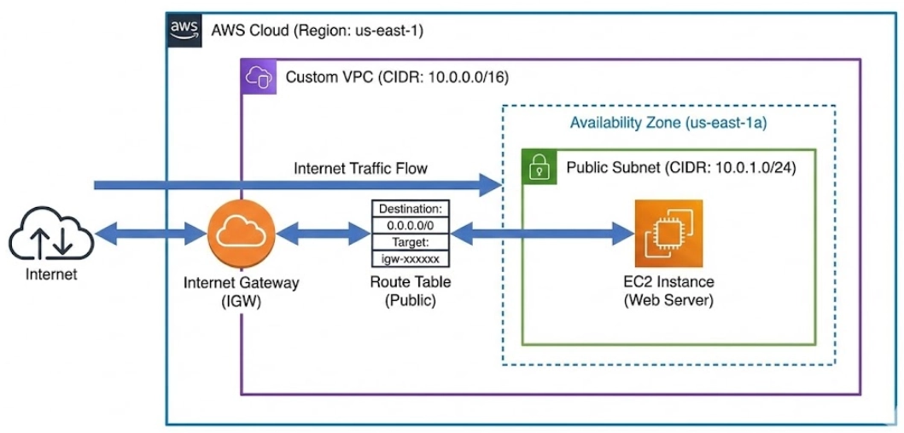

# Project 3: Create a Custom VPC 🚀

### Project Overview
In the previous project, you launched an EC2 instance into the Default VPC (which AWS creates for you automatically). In this project, you will build your own isolated network from scratch to understand how traffic flows in the cloud.

### 🎯 Key Learning Points:
* **VPC (Virtual Private Cloud):** You will learn how to build your own private network space in AWS and define the IP address range (CIDR block).
* **Subnets:** You will learn how to divide your VPC into smaller network segments, specifically creating a Public Subnet for resources that need to be accessible.
* **Internet Gateway (IGW):** You will learn how to attach and configure the component that allows resources inside your isolated VPC to communicate with the outside internet.
* **Route Tables:** You will learn how to direct network traffic by creating a route that sends internet-bound traffic (`0.0.0.0/0`) specifically to the Internet Gateway.

---

### 🚀 Lab Guide: Step-by-Step Guide
In this project, we will build a `10.0.0.0/16` network and create a `10.0.1.0/24` subnet within it.

#### Step (1) - Create VPC
1. Go to **AWS Console** → Search for **VPC service** and enter
2. Click **"Your VPCs"** in the left menu
3. Click **"Create VPC"** button
4. Under **Resources to create**, select **VPC only** (Do NOT select "VPC and more" because we want to learn the manual way)
5. In **Name tag**, enter: `My-Custom-VPC`
6. In **IPv4 CIDR block**, enter: `10.0.0.0/16` (This provides over 65,000 IP addresses)
7. Click **"Create VPC"**

#### Step (2) - Create Subnet
1. Click **"Subnets"** in the left menu
2. Click **"Create subnet"**
3. Under **VPC ID**, select `My-Custom-VPC` that we just created
4. In **Subnet name**, enter: `My-Public-Subnet`
5. For **Availability Zone**, select **us-east-1a** (or your preferred one)
6. In **IPv4 CIDR block**, enter: `10.0.1.0/24` (This provides 256 IP addresses)
7. Click **"Create subnet"**

#### Step (3) - Create Internet Gateway
Just creating a VPC doesn't give internet access. We need to attach a gateway.

1. Click **"Internet gateways"** in the left menu
2. Click **"Create internet gateway"**
3. In **Name tag**, enter: `My-IGW`
4. Click **"Create internet gateway"**
5. After creation, click **"Actions"** → **"Attach to VPC"** (top right corner)
6. Under **Available VPCs**, select `My-Custom-VPC`
7. Click **"Attach internet gateway"**

#### Step (4) - Configure Route Table
Without setting routes, EC2 instances in the subnet won't know about the Internet Gateway.

1. Click **"Route tables"** in the left menu
2. Click **"Create route table"**
3. In **Name tag**, enter: `My-Public-Route-Table`
4. Under **VPC**, select `My-Custom-VPC`
5. Click **"Create route table"**
6. After creation, click **"Routes"** tab → **"Edit routes"**
7. Click **"Add route"**
8. For **Destination**, enter: `0.0.0.0/0` (This means the entire internet)
9. For **Target**, select **Internet Gateway** and choose `My-IGW` that we created
10. Click **"Save changes"**

#### Step (5) - Associate Subnet with Route Table
1. While still in `My-Public-Route-Table`, click **"Subnet associations"** tab
2. Click **"Edit subnet associations"**
3. Check the box next to `My-Public-Subnet`
4. Click **"Save associations"**
   *(Now your subnet is a true Public Subnet)*

#### Step (6) - Create EC2 in Custom VPC
1. Go back to **EC2 service** → **"Launch instance"**
2. Name: `VPC-Test-Server`
3. OS: **Amazon Linux**
4. Key pair: You can reuse the key from Project 2
5. In **Network settings**, click **"Edit"** (this is important)
   * VPC: Select `My-Custom-VPC` (notice it's not the default VPC)
   * Subnet: Make sure it's `My-Public-Subnet`
   * Auto-assign Public IP: Select **"Enable"** (if you don't do this, no public IP will be assigned and you can't access from internet)
   * Security Group: **Create new security group**
      * Allow **HTTP (Port 80)** from **Anywhere (0.0.0.0/0)**
      * Allow **SSH (Port 22)** from **Anywhere (0.0.0.0/0)**
6. Click **"Launch instance"**

---
[⬅️ Back to Main Menu](../README.md)
