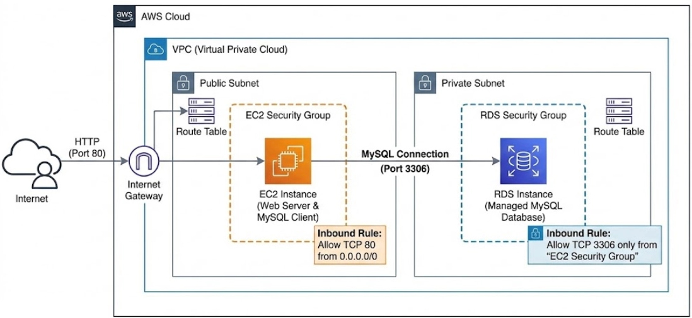

# Project 4: Secure Web App with a Private Database 🚀

In this project, you will build a secure network with two different zones. You will learn how to keep a database safe by hiding it from the internet while allowing your web server to talk to it.



### 🎯 What You Will Learn
* **Network Isolation:** The difference between Public and Private subnets.
* **DB Subnet Groups:** How to tell RDS which subnets it is allowed to use.
* **Security Group Chaining:** How to let your Web Server talk to your Database securely.

---

### 🚀 Step-by-Step Guide

#### Step 1: Create VPC and Subnets
1. Create a VPC named `Project4-VPC` with CIDR `10.0.0.0/16`.
2. Create **3 Subnets**:
   * **Public-Subnet-1**: AZ `us-east-1a`, CIDR `10.0.1.0/24`.
   * **Private-Subnet-1**: AZ `us-east-1a`, CIDR `10.0.2.0/24`.
   * **Private-Subnet-2**: AZ `us-east-1b`, CIDR `10.0.3.0/24`.

#### Step 2: Internet Access (Public Only)
1. Create an **Internet Gateway** (`Project4-IGW`) and attach it to your VPC.
2. Create a **Route Table** (`Public-RT`).
3. Add a route: **Destination** `0.0.0.0/0` -> **Target** `Project4-IGW`.
4. Associate only `Public-Subnet-1` with this route table.

#### Step 3: Create Security Groups
1. **Web-SG**: Allow **SSH (22)** and **HTTP (80)** from anywhere.
2. **DB-SG**: Allow **MySQL (3306)**, but set the **Source** to your `Web-SG`.

#### Step 4: Create DB Subnet Group
1. Go to the **RDS Console** -> **Subnet groups**.
2. Click **Create DB Subnet Group**.
3. Select your VPC and add the two **Private** subnets (`10.0.2.0/24` and `10.0.3.0/24`).

#### Step 5: Create Private RDS Database
1. Create a **MySQL** database (Free Tier).
2. Set your **Master username** and **Password**.
3. Under **Connectivity**:
   * Select `Project4-VPC`.
   * Choose your `my-db-subnet-group`.
   * **Public access:** Select **"No"**.
   * **VPC security group:** Choose `DB-SG`.

#### Step 6: Test the Connection
1. Launch an EC2 instance in the **Public Subnet** using `Web-SG`.
2. Connect to the EC2 and install a MySQL client:
   ```bash
   sudo dnf update -y
   sudo dnf install mariadb105 -y
   ```
3. Test the connection:
   ```bash
   mysql -h <RDS-ENDPOINT> -u admin -p
   ```

---
[⬅️ Back to Main Menu](../README.md)
