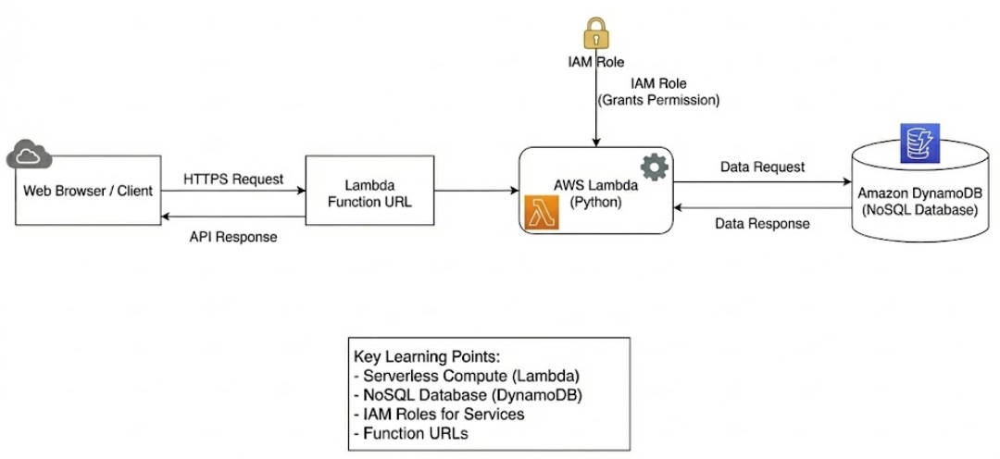

# Project 5: Serverless API with Lambda & DynamoDB 🚀

### Project Overview
In this project, you will build a modern "Serverless" application. Instead of provisioning and managing virtual servers, you will use AWS Lambda to run your code only when needed, and DynamoDB for a fast, scalable NoSQL database.



### 🎯 Key Learning Points:
* **Serverless Compute (Lambda):** You will learn how to write and deploy code (Python) that runs without you ever needing to manage an OS or server.
* **NoSQL Database (DynamoDB):** You will learn how to create a schemaless table that can handle massive traffic with millisecond latency.
* **IAM Roles for Services:** You will learn how to grant permission for one AWS service (your Lambda code) to access another AWS service (your DynamoDB table) securely.
* **Function URLs:** You will learn how to expose your Lambda function as a public API endpoint accessible via a web browser.

---

### 🚀 Lab Guide: Step-by-Step Guide
For this project, you don't need to build any network (VPC/Subnet). AWS manages everything for you.

#### Step (1) - Create DynamoDB Table
First, let's create a place to store our data.

1. Go to **DynamoDB Console**
2. Click **"Create table"**
3. Table name: `UserData`
4. Partition key: `userid` (set as **String**)
5. Table settings: Keep default settings
6. Click **"Create table"**

#### Step (2) - Create Lambda Function
1. Go to **Lambda Console**
2. Click **"Create function"**
3. Select **"Author from scratch"**
4. Function name: `MyServerlessAPI`
5. Runtime: **Python 3.9** (or any version you prefer)
6. Architecture: **x86_64**
7. Click **"Create function"**

#### Step (3) - Grant Database Permissions to Lambda (IAM Role)
Just creating a Lambda function doesn't allow it to write to the database. We need to give it permission first.

1. On the `MyServerlessAPI` function page, click the **Configuration** tab
2. Click **Permissions** on the left side
3. Under **Execution role**, click the **Role Name** (e.g., `MyServerlessAPI-role-xyz...`). This will take you to the IAM Console.
4. In the IAM Console, click **"Add permissions"** → **"Attach policies"**
5. In the search box, search for `DynamoDB`
6. Check **AmazonDynamoDBFullAccess** (In real production, you should give more restricted permissions, but for learning, we'll give full access)
7. Click **"Add permissions"**
8. Return to the Lambda Console

#### Step (4) - Write the Code
1. Go to the **Code** tab
2. Delete the existing code in `lambda_function.py` and copy-paste this code:

```python
import json
import boto3
import uuid

# Connect to DynamoDB
dynamodb = boto3.resource('dynamodb')
table = dynamodb.Table('UserData')

def lambda_handler(event, context):
    # Create a random ID
    user_id = str(uuid.uuid4())
    
    # Insert data into database
    table.put_item(
        Item={
            'userid': user_id,
            'message': 'Hello from Serverless World!',
            'status': 'Success'
        }
    )
    
    return {
        'statusCode': 200,
        'body': json.dumps(f'Successfully saved User ID: {user_id}')
    }
```
> ⚠️ **IMPORTANT:** Click the **"Deploy"** button (above the code box) to save your code.

#### Step (5) - Make it a Public API (Function URL)
1. Go back to the **Configuration** tab
2. Click **Function URL** on the left side
3. Click **"Create function URL"**
4. Auth type: Select **NONE** (This allows public access)
5. Click **"Save"**
6. You will get a link like: `https://...lambda-url...`

#### Step (6) - Testing
1. Copy the Function URL link and paste it into your browser (Chrome)
2. If you see `"Successfully saved User ID: ..."` in the browser, your API is working!
3. To double-check, go back to **DynamoDB Console**
4. Click **"Explore items"** (left menu) and select the `UserData` table
5. You'll see new data added every time you refresh the browser! 🎉

---
[⬅️ Back to Main Menu](../README.md)
